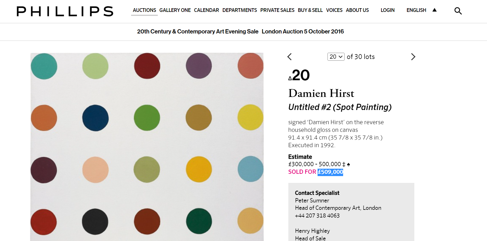

# Hirst-Painting
<h1>Create master peices of Damien Hirst's Spot Painting in a pythonic way!</h1>

<h3>For the curious one's: </h3>

Damien Hirst's Spot Paintings are sold for <em><b>more than 5 lac pounds</b></em>. Don't believe me. Watch yourself 

'''This project is just made for fun'''
